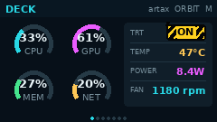

# Jetson Stats PiTFT

A fast, compact telemetry dashboard for an NVIDIA Jetson AGX Orin and the
Adafruit 1.14-inch ST7789 Mini PiTFT. It draws directly with Pillow, converts
frames to RGB565 with NumPy, and writes straight to `/dev/spidev0.0`: no X11,
Wayland, browser, or heavyweight dashboard process.



## What it shows

The encoder and two front buttons move through six live pages:

1. **Deck** — CPU and GPU gauges, memory, temperature, power, and fan speed
2. **CPU** — all 12 cores, aggregate utilization, load, and a sparkline
3. **GPU** — GR3D load, board power, temperature, and history
4. **Memory** — RAM, swap, and root filesystem capacity
5. **Network** — interface, address, RX/TX rates, and traffic history
6. **System** — hostname, power mode, JetPack, L4T, kernel, and uptime

Controls:

- Turn encoder: cycle backward/forward through color schemes
- Press top PiTFT button: previous page
- Press bottom PiTFT button: next page
- Press encoder: toggle automatic page rotation (eight seconds per page)

The original **Orbit** colors remain the startup default. The additional
schemes are Ember, Matrix, Synth, and Arctic. Button polarity is learned from
the idle level at service startup, so both PiTFT buttons act on press even when
their electrical idle levels differ.

The boot helper also sets the Tegra PADCTL pull-up field on all five navigation
inputs. GPIO character-device bias flags do not override a pad left in Tegra's
hardware pull-down state on this platform.

Telemetry comes from one persistent NVIDIA `tegrastats` process plus lightweight
Linux interfaces such as `/proc`, `/sys`, `statvfs`, and the network address
ioctl. Static identity and slow-changing network details are cached. The default
screen update is 2 Hz while GPIO input is sampled independently at 200 Hz.
The SPI clock defaults to the signal-integrity-tested 4 MHz; the tiny frame is
still transferred quickly at that conservative rate.

The 135-pixel panel is centered in a 240-pixel controller dimension with an odd
remainder. The driver clears the extra controller column at X=52 before drawing
the 135 content columns at X=53, preventing a retained garbage scanline along
the rotated top edge.

For a lively instrument-panel feel, each authoritative 2 Hz sample is revealed
through semantic child regions in a shuffled sequence at 20 updates per second.
Only the affected gauge, row, or graph segment is transferred over SPI. This
perceptual refresh does not fabricate telemetry, and `--micro-fps 0` disables it.

## Supported hardware and wiring

This release targets the **Jetson AGX Orin Developer Kit, P3737 carrier plus
P3701 module**, on JetPack 7 / L4T R39. It deliberately refuses to alter live
PADCTL registers on another board.

| Function | Header pin | Tegra line | PADCTL address |
|---|---:|---|---:|
| Encoder A | 11 | PR.04 | `0x02430098` |
| Encoder B | 12 | PH.07 | `0x02434088` |
| PiTFT previous | 16 | PBB.01 | `0x0C303048` |
| PiTFT next | 18 | PH.00 | `0x02434040` |
| TFT MOSI | 19 | SPI1_MOSI | configured by SPI project |
| TFT D/C | 22 | PP.04 | configured by SPI project |
| TFT SCLK | 23 | SPI1_SCLK | configured by SPI project |
| TFT CS | 24 | SPI1_CS0 | configured by SPI project |
| Encoder switch | 29 | PAA.01 | `0x0C303018` |

The physical header's SPI1 controller appears as `/dev/spidev0.0` on this
platform. First configure its live pins with
[AGX-Orin-SPI1](https://github.com/manbehindthemadness/AGX-Orin-SPI1). A spidev
node alone does not prove that the header pads are muxed to SPI.

## Install and start at boot

```bash
git clone https://github.com/manbehindthemadness/Jetson-stats-pitft.git
cd Jetson-stats-pitft
./install.sh
```

The installer:

- installs the small Python/runtime dependencies from Ubuntu packages;
- creates `/opt/jetson-stats-pitft/venv` using system packages;
- installs a guarded boot-time helper for the five input pads;
- enables `agx-orin-pitft-input-pinmux.service`;
- enables and starts `jetson-stats-pitft.service` as the invoking user.

The SPI pinmux service from AGX-Orin-SPI1 should already be enabled. Check the
dashboard with:

```bash
systemctl status jetson-stats-pitft.service
journalctl -u jetson-stats-pitft.service -f
```

The LCD retains its last pixels without further SPI traffic. When testing,
select a visibly different page instead of treating an unchanged image as proof
that a new frame arrived:

```bash
sudo systemctl stop jetson-stats-pitft.service
sudo /opt/jetson-stats-pitft/venv/bin/jetson-stats-pitft --once --page system
sudo systemctl start jetson-stats-pitft.service
```

## Run from a checkout

On a configured Jetson:

```bash
python3 -m jetson_stats_pitft --page deck
```

Useful development options:

```bash
# Create all six mock PNGs without touching the display
python3 -m jetson_stats_pitft --preview-dir docs/previews

# Draw one distinct live frame and exit
python3 -m jetson_stats_pitft --once --page system

# Run without requesting the navigation GPIOs
python3 -m jetson_stats_pitft --no-input
```

## Design notes

The page selection is inspired by the excellent
[jetson-stats / jtop](https://github.com/rbonghi/jetson_stats) interface. This
project contains an original, purpose-built renderer and collector rather than
copying jtop code; it stays Apache-2.0 licensed and optimized for a 240×135 TFT.

The live PADCTL helpers are intentionally a boot-time bridge, not a replacement
for a board-specific device-tree configuration. Their original register values
are saved under `/run` and can be restored during the same boot:

```bash
sudo agx-orin-pitft-input-pinmux status
sudo agx-orin-pitft-input-pinmux restore
```
